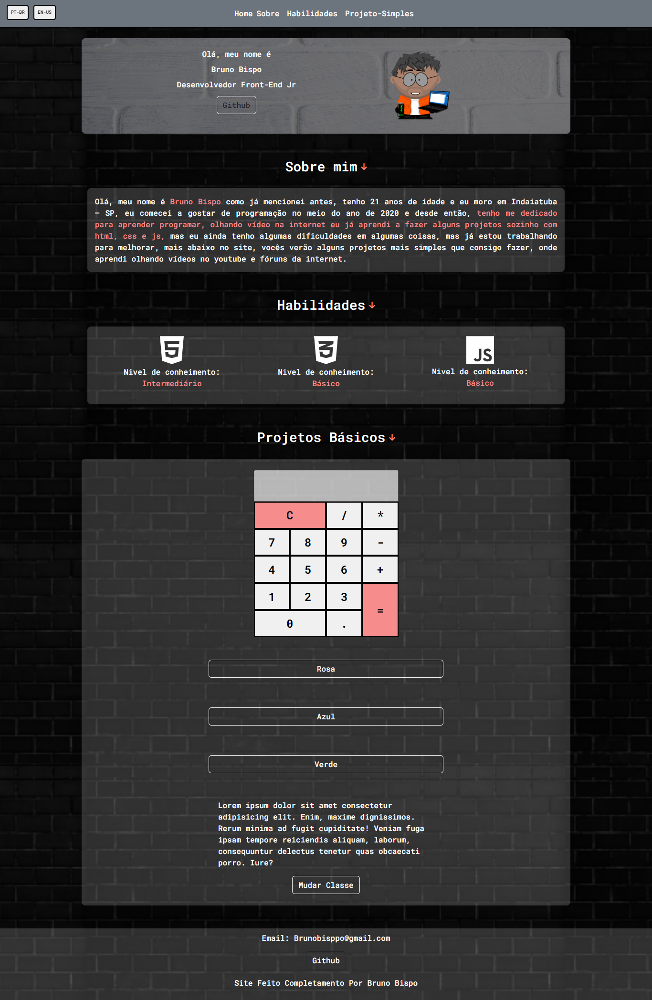

# Portifólio feito com Html, Css, javaScript e Boostrap 5.

➡️ O meu portfólio foi feito com html, css e js, neste projeto simples eu consegui colocar algumas interações básicas como a calculadora, a seleção de cores e a seleção de classe, além do seletor de idioma que foi feito totalmente manual usando o text.content em todos os textos.

## CALCULADORA:
A calculadora tem 17 botões onde pode-se fazer contas básicas nela.

## SELEÇÃO DE CORES:
Muda a background da caixa que está na cor padrão, no caso pode-se se escolher três cores, que são vermelho, azul e verde.

## MUDANÇA DE CLASSE:
Quando o botão for clicado ele mudara a classe que o texto está, para outra classe com uma font-family diferente.

## SELEÇÃO DE IDIOMAS:
A seleção de idiomas é onde você pode escolher entre dois idiomas possíveis que são inglês e português, dependo da resolução do seu dispositivo este botão ficara com o position: fixed.

## Site completo: ⬇️

##  O que foi usado ⬇️

<svg xmlns="http://www.w3.org/2000/svg" viewBox="0 0 384 512"><!--! Font Awesome Pro 6.1.1 by @fontawesome - https://fontawesome.com License - https://fontawesome.com/license (Commercial License) Copyright 2022 Fonticons, Inc. --><path d="M0 32l34.9 395.8L191.5 480l157.6-52.2L384 32H0zm308.2 127.9H124.4l4.1 49.4h175.6l-13.6 148.4-97.9 27v.3h-1.1l-98.7-27.3-6-75.8h47.7L138 320l53.5 14.5 53.7-14.5 6-62.2H84.3L71.5 112.2h241.1l-4.4 47.7z"/></svg>

<svg xmlns="http://www.w3.org/2000/svg" viewBox="0 0 512 512"><!--! Font Awesome Pro 6.1.1 by @fontawesome - https://fontawesome.com License - https://fontawesome.com/license (Commercial License) Copyright 2022 Fonticons, Inc. --><path d="M480 32l-64 368-223.3 80L0 400l19.6-94.8h82l-8 40.6L210 390.2l134.1-44.4 18.8-97.1H29.5l16-82h333.7l10.5-52.7H56.3l16.3-82H480z"/></svg>

<svg xmlns="http://www.w3.org/2000/svg" viewBox="0 0 448 512"><!--! Font Awesome Pro 6.1.1 by @fontawesome - https://fontawesome.com License - https://fontawesome.com/license (Commercial License) Copyright 2022 Fonticons, Inc. --><path d="M0 32v448h448V32H0zm243.8 349.4c0 43.6-25.6 63.5-62.9 63.5-33.7 0-53.2-17.4-63.2-38.5l34.3-20.7c6.6 11.7 12.6 21.6 27.1 21.6 13.8 0 22.6-5.4 22.6-26.5V237.7h42.1v143.7zm99.6 63.5c-39.1 0-64.4-18.6-76.7-43l34.3-19.8c9 14.7 20.8 25.6 41.5 25.6 17.4 0 28.6-8.7 28.6-20.8 0-14.4-11.4-19.5-30.7-28l-10.5-4.5c-30.4-12.9-50.5-29.2-50.5-63.5 0-31.6 24.1-55.6 61.6-55.6 26.8 0 46 9.3 59.8 33.7L368 290c-7.2-12.9-15-18-27.1-18-12.3 0-20.1 7.8-20.1 18 0 12.6 7.8 17.7 25.9 25.6l10.5 4.5c35.8 15.3 55.9 31 55.9 66.2 0 37.8-29.8 58.6-69.7 58.6z"/></svg>

## 

## Contato: 

📧 Email: Bisppobruno@gmail.com
💻 Linkedin : https://www.linkedin.com/in/bruno-bisppo/
